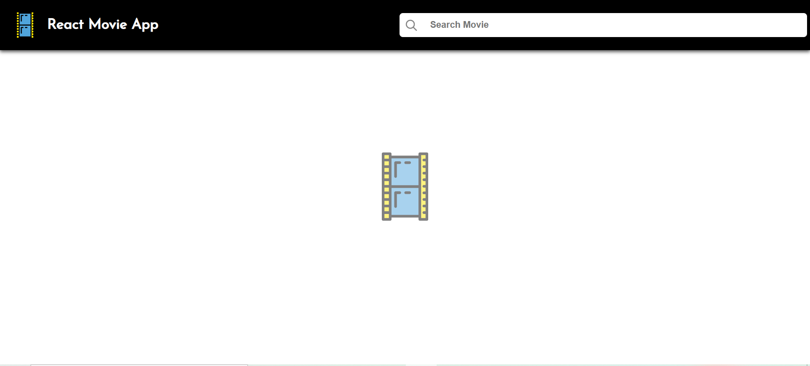
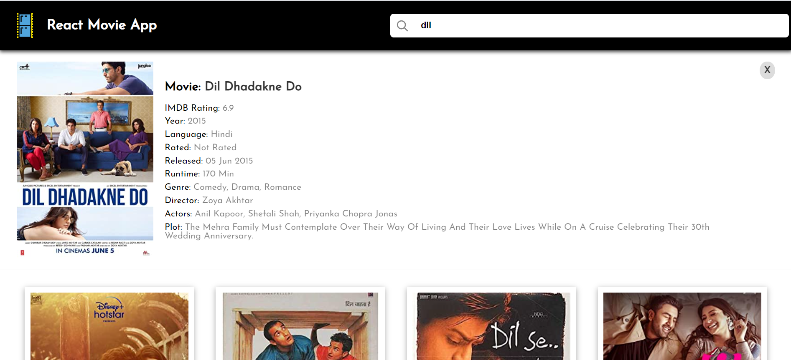

# Movie Search App - Application Based on React

### About the Project

A single-page web application that allows users to search for movies based on their queries. It searchs movies based on name provided. It searches the most relevant movie to the input query.

### Technologies

- **React**
  - Hooks
  - Components
- **CSS**
  - CSS Flex
- **JavaScript**
  - Fetch API
  - ES6
- **API**
  - OMDB API

### Libraries Used

- `styled-components`
- `axios`

### API Used

Open Movie Database (OMDB) API

Generate your API key from: [OMDB API Key](http://www.omdbapi.com/apikey.aspx)

### API Information

- **Method**: `GET`
- **Search URL**: `https://www.omdbapi.com/?s={MOVIE_NAME}&apikey={API_KEY}`
- **Movie Details URL**: `https://www.omdbapi.com/?i={MOVIE_ID}&apikey={API_KEY}`

### How It Works

1. Enter a movie name in the search input.
2. The app fetches movie information from the OMDB API.
3. The information is returned as a JSON object.
4. React components structure the data into a presentational format.
5. CSS creates a visually appealing and user-friendly application.

### Screenshots

The UI looks like:-

